<p align="center">
  
</p>

<p align="center">
  <strong>Learn decompilation by building one from scratch.</strong><br>
  <sub>19 stages. Every step inspectable. From raw RISC-V bytes to readable C.<br>
  RV32I: the simplest real ISA, so the focus stays on decompilation, not instruction encoding.</sub>
</p>

<p align="center">
  
  <a href="https://tiny-dec.zzhang.xyz"></a>
  
  
  
</p>

> [!TIP]
> *This project is inspired by the amazing open-source efforts behind [angr](https://github.com/angr/angr), [radare2](https://github.com/radareorg/radare2), and [Ghidra](https://github.com/NationalSecurityAgency/ghidra). Thanks for all the open-source work that makes projects like this possible.*

> [!NOTE]
> **This is a teaching tool, not a production decompiler.** The pipeline is deliberately factored into many small, isolated stages so that each concept can be studied independently. A real-world decompiler (Ghidra, IDA, angr, Binary Ninja) would fuse, reorder, or iterate these passes for performance and precision. We trade that efficiency for clarity: if you can follow each stage here, you will understand what the production tools are doing under the hood.

## Learn with Our AI Tutor

We ship tiny-dec as a **[Claude Code](https://claude.ai/claude-code) plugin**. An AI tutor assesses your level, walks you through each pipeline stage, quizzes you, and lets you experiment with real binaries, all inside your terminal.

<p align="center"></p>

## See the Pipeline in Action

<p align="center">
  <a href="https://tiny-dec.zzhang.xyz"></a><br>
  <sub>A bird's-eye view of all 19 stages. Explore interactively at <a href="https://tiny-dec.zzhang.xyz">tiny-dec.zzhang.xyz</a>.</sub>
</p>

## Quick Start

### Learn with the AI Tutor

Install [Claude Code](https://claude.ai/claude-code), then:

```bash
# 1. Add the marketplace
/plugin marketplace add ZhangZhuoSJTU/tiny-dec

# 2. Install the plugin
/plugin install tiny-dec@tiny-dec

# 3. Reload to activate
/reload-plugins
```

Type **`/tiny-dec:teach-decompilation`** to start.

### Install from Source

```bash
# System dependencies (Ubuntu/Debian)
sudo apt-get install -y clang lld llvm binutils build-essential python3 python3-pip

# Python dependencies
pip install poetry
poetry install

# Build RV32I fixture binaries for tests
./scripts/build_fixtures.sh
```

#### Decompile

```bash
# Full decompilation to C (default)
tiny-dec decompile ./binary.elf

# Target a specific function
tiny-dec decompile ./binary.elf --func parse_record

# Stop at any intermediate stage and look inside
tiny-dec decompile ./binary.elf --stage ssa --func main

# Inspect binary metadata
tiny-dec info ./binary.elf
```

Every stage is a window into the pipeline:

```
loader → decode → pcode → disasm → ir → simplify → dataflow → ssa
→ calls → stack → memory → scalar_types → aggregate_types → variables
→ range → interproc → structuring → c_lowering → c
```

#### Test

```bash
poetry run pytest            # all 500 tests
poetry run ruff check .      # lint
poetry run mypy tiny_dec     # type check
```


## Example Output

**Raw RISC-V instructions go in.** Readable C comes out:

<table>
<tr>
<th>Assembly (RV32I)</th>
<th>Decompiled Output</th>
</tr>
<tr>
<td valign="top">

```asm
; parse_record
addi x2, x2, -32
sw   x1, 28(x2)
sw   x8, 24(x2)
addi x8, x2, 32
sw   x10, -12(x8)
sw   x11, -16(x8)
addi x10, x0, 0
sw   x10, -20(x8)
sw   x10, -24(x8)
jal  x0, 0x11154
lw   x10, -24(x8)
lw   x11, -16(x8)
bge  x10, x11, 0x111b8
lw   x10, -12(x8)
lw   x11, -24(x8)
slli x11, x11, 3
add  x10, x10, x11
lw   x11, 0(x10)
lw   x10, -20(x8)
add  x10, x10, x11
sw   x10, -20(x8)
lw   x10, -12(x8)
lw   x11, -24(x8)
slli x11, x11, 3
add  x10, x10, x11
lw   x11, 4(x10)
lw   x10, -20(x8)
add  x10, x10, x11
sw   x10, -20(x8)
lw   x10, -24(x8)
addi x10, x10, 1
sw   x10, -24(x8)
jal  x0, 0x11154
lw   x10, -20(x8)
lw   x1, 28(x2)
lw   x8, 24(x2)
addi x2, x2, 32
jalr x0, 0(x1)
```

</td>
<td valign="top">

```c
#include <stdint.h>

typedef struct agg_8 {
  int32_t field_0;
  int32_t field_4;
} agg_8;

static uint32_t main(void) {
  int32_t local_24_4;
  int32_t local_20_4;
  int32_t local_16_4;
  int32_t local_12_4;
  uint32_t call_ret;

  local_12_4 = 20;
  local_16_4 = 2;
  local_20_4 = 10;
  local_24_4 = 1;
  call_ret = parse_record(&local_24_4, 2);
  return call_ret;
}

static uint32_t parse_record(
    agg_8* arg_x10_4,
    int32_t arg_x11_4) {
  int32_t local_24_4;
  int32_t local_20_4;

  local_20_4 = 0;
  local_24_4 = 0;
  while (local_24_4 <s arg_x11_4) {
    local_20_4 = local_20_4
        + arg_x10_4[local_24_4].field_0;
    local_20_4 = local_20_4
        + arg_x10_4[local_24_4].field_4;
    local_24_4 = local_24_4 + 1;
  }
  return local_20_4;
}
```

</td>
</tr>
</table>

> Recovered: **struct layout**, **pointer parameter**, **while loop**, **array indexing with field access**, and **local variables**.

It handles more than loops and structs:

```c
// Switch recovery from equality-ladder CFG patterns
static int32_t dispatch(uint32_t arg_x10_4, uint32_t arg_x11_4) {
  uint32_t local_24_4;
  uint32_t local_12_4;

  local_24_4 = arg_x10_4;
  switch (arg_x10_4) {
  case 0:
    local_12_4 = arg_x11_4 + 1;
    break;
  case 1:
    local_12_4 = arg_x11_4 + 4;
    break;
  case 2:
    local_12_4 = arg_x11_4 << 1;
    break;
  case 3:
    local_12_4 = arg_x11_4 - 3;
    break;
  default:
    local_12_4 = -1;
    break;
  }
  return local_12_4;
}
```

```c
// Interprocedural analysis with prototype inference
static int32_t main(void) {
  int32_t local_16_4;
  int32_t local_12_4;

  local_12_4 = 7;
  local_16_4 = helper(local_12_4);
  return local_16_4 - 2;
}

static int32_t helper(int32_t arg_x10_4) {
  return (arg_x10_4 << 1) + arg_x10_4 + 1;
}
```

## The Pipeline

19 stages, three phases. Each stage produces a typed, deterministic artifact you can inspect with `--stage`. The stages are split for learning purposes; a production decompiler would combine several of these into fewer, more tightly coupled passes.

### Phase 1: Frontend (Bytes to IR)

| # | Stage | What it does |
|---|-------|-------------|
| 00 | [**Loader**](tiny_dec/loader/) | Parse ELF structure, resolve symbols, find `main`. The loader is deliberately shallow: it delegates all ELF parsing to [pwntools](https://github.com/Gallopsled/pwntools) and uses simple heuristics for main discovery, since binary format parsing is not the educational focus of this project. |
| 01 | [**Decode**](tiny_dec/decode/) | Decode RV32I instruction words into structured objects |
| 02 | [**P-code Lift**](tiny_dec/ir/) | Lift each instruction into semantic p-code operations |
| 03 | [**Disassembly**](tiny_dec/disasm/) | Recursive traversal to build basic blocks and CFG |
| 04 | [**IR Containers**](tiny_dec/ir/) | Wrap functions and programs into durable typed containers |

### Phase 2: Analysis

| # | Stage | What it does |
|---|-------|-------------|
| 05 | [**Simplify**](tiny_dec/analysis/simplify/) | Constant folding, identity elimination, temporary forwarding |
| 06 | [**Dataflow**](tiny_dec/analysis/dataflow/) | Forward intraprocedural constant propagation |
| 07 | [**SSA**](tiny_dec/analysis/ssa/) | Dominance-frontier SSA with memory versioning |
| 08 | [**Calls**](tiny_dec/analysis/calls/) | Call classification, ABI argument/return snapshots |
| 09 | [**Stack**](tiny_dec/analysis/stack/) | Frame layout recovery, stack slot identification |
| 10 | [**Memory**](tiny_dec/analysis/memory/) | Partition recovery for stack, global, and pointer accesses |
| 11 | [**Scalar Types**](tiny_dec/analysis/types/) | Type inference: `bool`, `int`, `pointer`, `word` |
| 12 | [**Aggregate Types**](tiny_dec/analysis/types/) | Struct layout recovery from pointer arithmetic patterns |
| 13 | [**Variables**](tiny_dec/analysis/highvars/) | Group SSA values and memory slots into named variables |
| 14 | [**Range**](tiny_dec/analysis/range/) | Interval analysis and branch predicate refinement |
| 15 | [**Interproc**](tiny_dec/analysis/interproc/) | Cross-function prototype inference and summaries |

### Phase 3: Backend (Structure and Emit)

| # | Stage | What it does |
|---|-------|-------------|
| 16 | [**Structuring**](tiny_dec/structuring/) | Recover `if` / `while` / `switch` from CFG topology |
| 17 | [**C Lowering**](tiny_dec/c_emit/) | Lower to C-like IR with typed declarations and expressions |
| 18 | [**C Render**](tiny_dec/pipeline/) | Emit readable C with precedence-aware formatting |

## Project Layout

```
tiny_dec/
├── loader/            ELF loading and symbol resolution
├── decode/            RV32I instruction decoder
├── ir/                P-code semantics and IR containers
├── disasm/            Recursive disassembler and CFG builder
├── analysis/
│   ├── simplify/      Canonical IR cleanup
│   ├── dataflow/      Constant propagation
│   ├── ssa/           SSA construction
│   ├── calls/         Call modeling and ABI facts
│   ├── stack/         Stack frame recovery
│   ├── memory/        Memory partitioning
│   ├── types/         Scalar and aggregate type recovery
│   ├── highvars/      Variable recovery
│   ├── range/         Range and predicate analysis
│   └── interproc/     Interprocedural summaries
├── structuring/       Control-flow structuring
├── c_emit/            C lowering and rendering
├── pipeline/          End-to-end decompilation driver
└── cli.py             Command-line interface

tests/
├── fixtures/
│   ├── src/           13 C programs (loops, structs, calls, switches, ...)
│   └── bin/           39 cross-compiled RV32I ELF binaries
└── posts/
    └── post_00/ ... post_18/    One test suite per pipeline stage
```

## Why Is It Built This Way?

**Explicit over clever.** Every intermediate representation is a concrete, typed Python dataclass. No hidden state, no magic.

**Deterministic output.** Every stage has a text renderer that produces identical output given identical input. This is both the debugging surface and the test oracle.

**One stage, one job.** Each stage solves exactly one problem and passes a well-defined artifact to the next. You can stop the pipeline at any point and inspect what it produced.

**Conservative analysis.** The pipeline never invents information. When evidence is ambiguous, it preserves the raw form rather than guessing. Residual `raw<...>` expressions in the output are honest about what the analysis couldn't resolve.

**This is a teaching tool, not a production decompiler.** The pipeline is deliberately factored into many small, isolated stages so that each concept can be studied independently. A real-world decompiler (Ghidra, IDA, angr, Binary Ninja) would fuse, reorder, or iterate these passes for performance and precision. We trade that efficiency for clarity: if you can follow each stage here, you will understand what the production tools are doing under the hood.

## Fixture Binaries

13 C programs compiled to RV32I ELF at three optimization levels (39 binaries total, with strict no-compressed-instruction verification):

| Variant | Flags | Purpose |
|---------|-------|---------|
| `*_O0_nopie` | `-O0 -fno-pie` | Unoptimized, predictable stack layout |
| `*_O2_nopie` | `-O2 -fno-pie` | Optimized, tests register allocation recovery |
| `*_O2_pie` | `-O2 -fpie` | Position-independent, tests GOT/PLT handling |

Rebuild with `./scripts/build_fixtures.sh` (requires `clang`, `lld`, `llvm` with RISC-V support).

## Further Reading

<p align="center">
  <a href="https://decompilation.wiki"></a>
  &nbsp;
  <a href="https://mahaloz.re"></a>
  &nbsp;
  <a href="https://github.com/ZhangZhuoSJTU/tiny-dec/issues/new?template=suggest-resource.yml"></a>
</p>

<p align="center"><sub>Actively-maintained resources that go deeper into the concepts behind each pipeline stage.</sub></p>

## Special Thanks

- [Seunghyun Sung](https://www.linkedin.com/in/seunghyun-sung/)
- [Hugo Matousek](https://www.linkedin.com/in/hugo-matousek/)

## License

[MIT](LICENSE)
